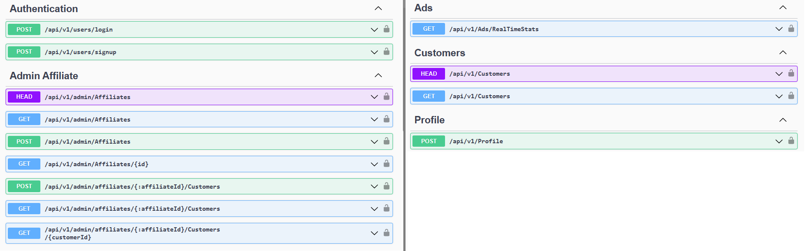
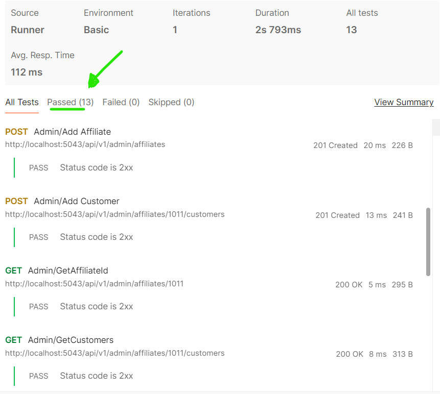
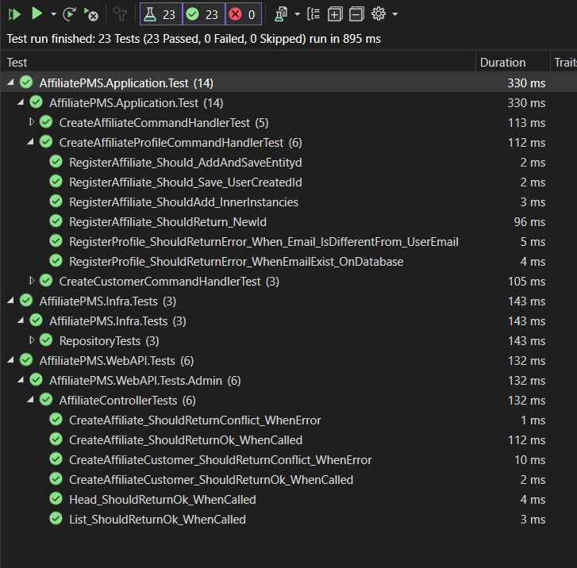
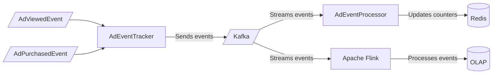

# APMS Project
APMS is a code name, it helps businesses manage their marketing efforts. It allows businesses to track the performance of their affiliates, manage ads, payments and marketing strategies. 

## Overview
Proof of Skills used in this project:
### Technologies:  
- .NET 8 
- JWT Authentication
- Mediatr
- Mapster for Mapping
- Fluent Validation
- EF Core
- Postman Collections for tests and examples

### Concepts:  
- Role Based Authorization
- JWT  Authentication
- Clean Architecture
- CQRS: Command Query Responsibility Segregation
- API Versioning
- Unity of Work
- Tests
- Docker

### Usage 
To use the `APMS Application`, you need to have Docker installed on your machine. 

Run the following command to start the application:

```bash
docker-compose up
```

[docker-compose.yml](docker-compose.yml)

#### Containers
`webapp`: This container runs the main application, which is built using .NET 8. It communicates with the db container to perform database operations. port:```8000```

`db`: This container runs SQL Server, which is used to store and manage the application's data. It receives requests from the webapp container and performs the necessary database operations.


#### SQL Server - Data Seed
> entrypoint.sh will create the database and add data for tests

Script for reference:
[DataBase Seeder](./database/init.sql)


## Application Overview: 

### Application Layers
#### WebAPI
This layer is responsible for handling HTTP requests and responses. It includes routing, serialization, error handling, and other web-related tasks. It communicates with the Application layer to process requests.

##### Authentication 
- AdminUser: 
  -  login: admin@example
  -  password: password-test
- _AffiliateUser:
    -  login: admin@example
    -  password: password-test

#### Application and CQRS
 It processes requests from the WebAPI layer, performs necessary computations or transformations, and communicates with the Domain layer for data.

> CQRS - command query responsibility segregation

- The Command stack is responsible for handling all commands, which are requests that modify the state of the system. 

- The Query stack is responsible for handling all queries. 
It is great when we need to access differente data strucutures, like: `consolidated data` or `real time analysis`. 
 
 
This separation allows for flexibility in scaling, as the Command stack and Query stack can be scaled independently based on their load. It also improves performance, as read and write operations can be optimized separately.


#### Domain
The Domain layer represents the business objects of the application. It includes entities, value objects, and aggregates. This layer is isolated and should not depend on any other layers.

#### Infra
The Infra layer provides concrete implementations of the interfaces defined in the Domain layer including persistence. 

Also, the dependency injection is there.

## Technical Details
#### Role Based Authorization

```csharp
[ApiController]
[Route("api/admin/[controller]")]
[Authorize(Role.Admin)]
public class AdminAffiliateController(IMediator mediator)...

[Route("api/[controller]")]
[ApiController]
[Authorize(Roles = Role.Affiliate)]
public class AffiliateController(IMediator mediator) ...
```


### Swagger / OpenAPI


#### Customers API Sample
http://localhost:5043/api/admin/AdminAffiliate/[affiliateId]/customers
```json 
   [
    {
        "id": 1,
        "email": "john@example.com",
        "fullName": "John Doe",
        "genderId": 1,
        "genderName": "Female",
        "birthDate": "1990-01-01",
        "avgTicket": 600.00,
        "totalPurchase": 10000.00
    },
    {
        "id": 2,
        "email": "jane@example.com",
        "fullName": "Jane Doe",
        "genderId": 2,
        "genderName": "Other",
        "birthDate": "1992-02-02",
        "avgTicket": 1000.00,
        "totalPurchase": 200000.00
    }
]
```
## Tests
### Postman Tests
You can use the Postman to perform API tests.


1. Download the [APMS Postman Collection](./src/AffiliateAppManagement/tests/APMS.postman_collection.json);

2. Prepare the environemtn

3. Click on "Run Collection"



##### Basic Postman Validation
Flows and Tests are written in Javascript.
```json
{
  "FullName": "{{$randomEmail}}",
  "email": "{{$randomEmail}}",
  "password": "{{password}}"
}```

```js
pm.test("Status code is 2xx", function () {...});
...
var affiliateId = pm.response.json().data.id;
pm.environment.set("affiliateId", affiliateId);

```

#### Unit Tests
Added the most important unit tests based on affiliate and customer scenarios.



### Commission and Reports
#### Ad RealTime Stats
Mock example of data from Redis 

```json
[
    {
        "adId": 1,
        "endTime": "2024-01-16T01:47:23.5372804-03:00",
        "productName": "Product 1",
        "productId": 1,
        "stats": {
            "totalViewed": 1,
            "totalPurchases": 1,
            "totalPurchasesAmount": 1,
            "visualizationsLastDay": 1,
            "purchasesLastDay": 1
        }
    },
    {
        "adId": 2,
        "endTime": "2024-01-17T01:47:23.5372848-03:00",
        "productName": "Product 2",
        "productId": 2,
        "stats": {
            "totalViewed": 2,
            "totalPurchases": 2,
            "totalPurchasesAmount": 2,
            "visualizationsLastDay": 2,
            "purchasesLastDay": 2
        }
    },
```


### Purchase Stats and Ad Tracker
Redis can be used for real time stats:



## Architecture & System Design

Please, click on the links bellow to see the full documentation of the project.

#### [Affiliate Design Document](./docs/AffiliateDesign.md)
#### [Ad Stats and Tracker Document](./docs/AdTrackerDesign.md)
#### [Ad Design Document](./docs/AdDesign.md)

