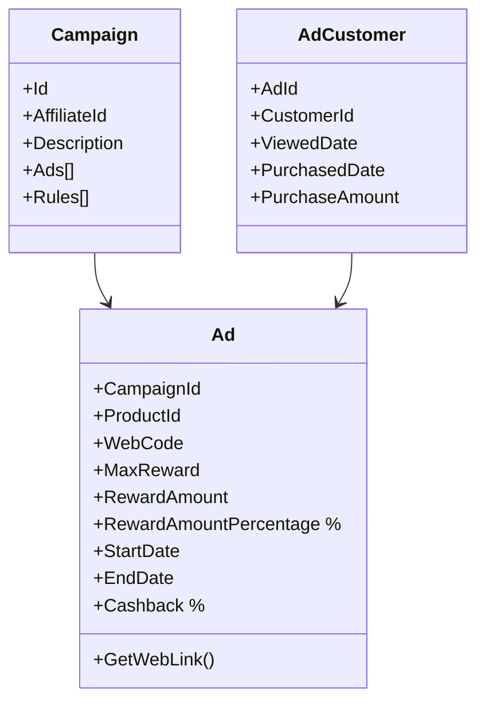

## Ad Diagram 

#### Campaign
Affiliate can have multiple products for the same campaign.

#### Ad
- ProductId: When specified limits the rewards only to the product
- MaxReward: Limit of reward: 1,000,000
- RewardAmount: Amount  to be redirect to affiliate for each product Item.    
- RewardAmountPercentage: When RewardAmount is not specified. We can calculated the amount based on the percentagem of the product.
- WebCode: Link identifier to be added on WebLink: givefreely.com/Wdksdlf

#### AdCustomer
- Track the customer lifecycle

### Insights
- AdTracker Service
    - Counter
        - TotalAmount
        - Views
        - Purcheses
        - TotalReward

