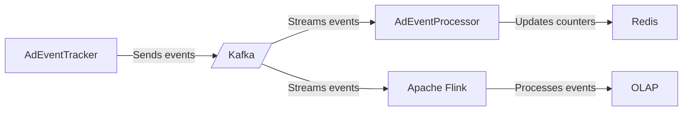
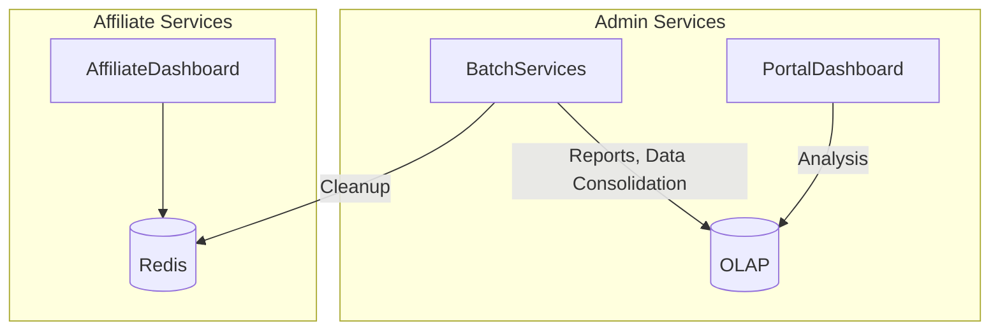

# Ad Tracker Design

#### Requirements
- An event can't count multiple times
- User must not see counts from other users, except admins
#### Non Functional Requirements
- High Availability
- Scalability and Slasticity
- Eventual Consistency

## Event Ingestion
### Ad Events
- Ad Viewed
- Ad Purchased

Apache Flink can be used for Sliding Window, aggregating ad events by:
- Last 24hours
- Last 1 week
- Last 30 days
- Total

### Services

## Counter Approaches
For heavy writer application we can use Distributed Counting.

- Relational Database is not the best option for distributed counter
- Apache Flink + Cassandra 
    - Cassandra can be slow for reads
- Redis (HyperLogLog) with 2% error (Reddit View Counter)
- Distributed Counter using CosmosDB
- Uber: Hive, Flink + Pinot
- Cassandra Counter Ignored for Distributed Counter: 
https://ably.com/blog/cassandra-counter-columns-nice-in-theory-hazardous-in-practice
- Mongo it does not support CRDT Conflict-Free Replicated Data Types. 
- Cosmos, Risc or Couchbase are good options
    - example using CosmosDB: 
https://learn.microsoft.com/en-us/samples/azure-samples/cosmos-db-design-patterns/distributed-counter/

