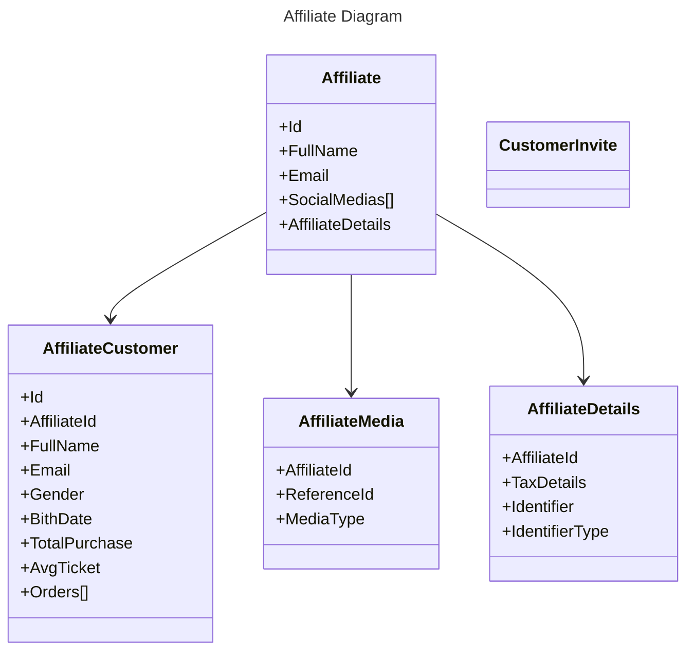
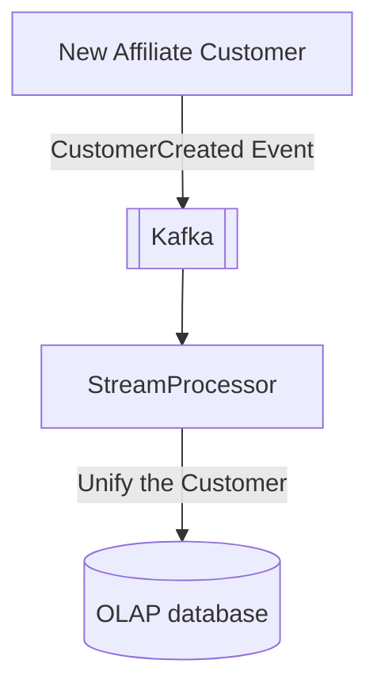
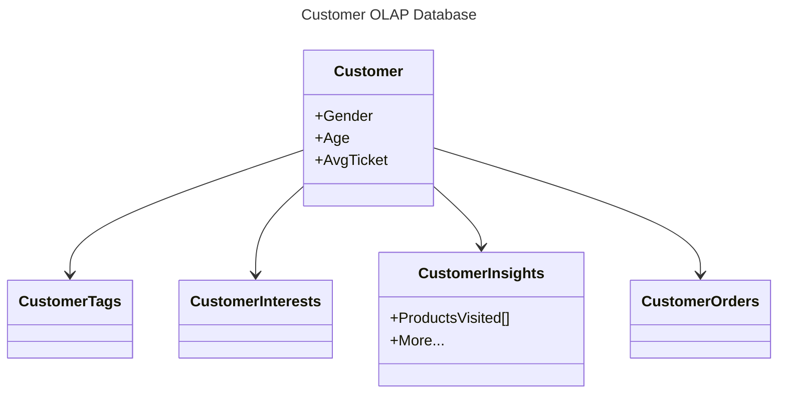

## Affiliate Design

### Core Diagram

1. We can't shared the customer information. Therefore, we isolated it for each affiliate
2. The customer data must be consolidated inside an internal database  

---

### Affilite Customer Creation

### CustomerData  

Used for Data Science and creating campaigns.
suggestions: Apache Druid, Pinot, Microsoft Analysis Services

### Tables:

- Affiliate:
- AffiliateDetail
- AffiliateSocialMedia
- AffiliateBankAccount
- AffiliateAddress
- AffiliateCustomer
- AffiliateCustomerTag
- Sales.OrderHeader
- Sales.Product
- Sales.OrderItem
- AppUser

### Marketing Management Insights

- Sales
    - Follow up System
        - Maintaining contact with potential customers after an initial interaction.     
    - Sales Funnel
        - Untouncehd
        - Contact mad (Leads)
        - Qualified Leads
        - Demo
        - Negotication
        - Deals Won

